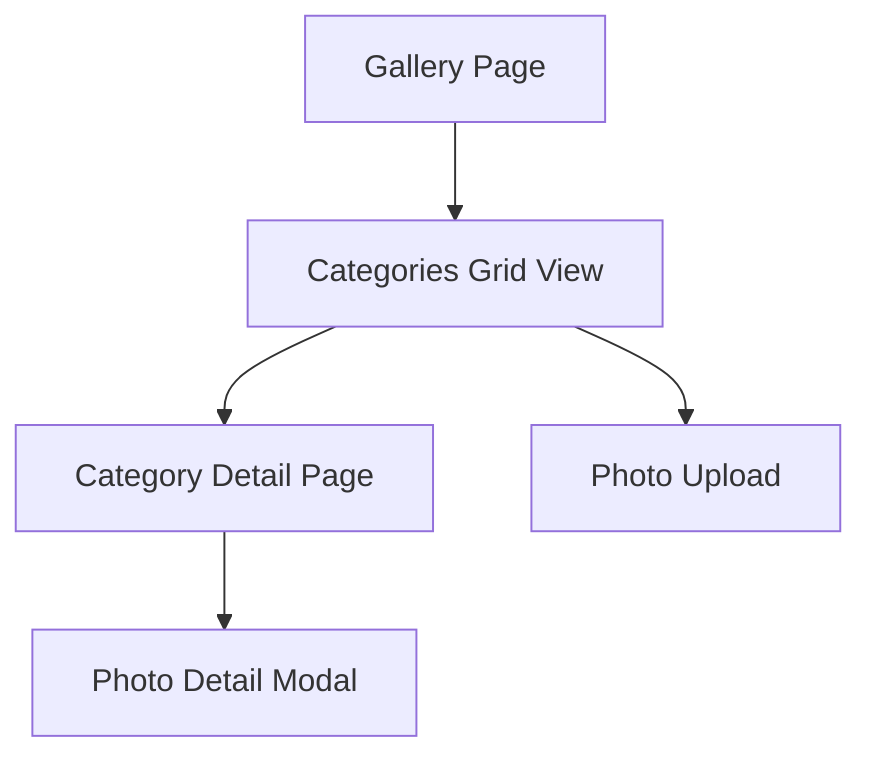

# Mobile Gallery Categories Redesign - Apple Photos Style

## 1. Product Overview

Redesign the mobile gallery categories section to match Apple Photos' album design, featuring a clean, minimalist grid layout where each category displays only the latest photo as a single thumbnail. This redesign will improve visual clarity, reduce cognitive load, and provide a more intuitive browsing experience similar to Apple's signature design language.

The redesign addresses the current cluttered category preview (showing 3 photos + count) by simplifying to a single latest photo per category, creating a cleaner, more focused interface that emphasizes visual discovery over information density.

## 2. Core Features

### 2.1 User Roles
No role distinction required - all authenticated users will have the same gallery experience.

### 2.2 Feature Module
The mobile gallery redesign consists of the following main components:
1. **Categories Grid**: Clean grid layout displaying categories as single photo thumbnails
2. **Category Cards**: Individual category representations with latest photo and metadata
3. **Navigation Interface**: Seamless transition to category detail views

### 2.3 Page Details

| Page Name | Module Name | Feature Description |
|-----------|-------------|---------------------|
| Gallery (Mobile) | Categories Grid | Display categories in 2-column grid layout with single latest photo thumbnails, category name, and photo count |
| Gallery (Mobile) | Category Card | Show latest photo as square thumbnail, category name below, photo count badge, tap to navigate to category detail |
| Gallery (Mobile) | Empty State | Display placeholder for categories with no photos, maintain grid consistency |
| Gallery (Mobile) | Loading State | Show skeleton loading animation matching Apple Photos style |

## 3. Core Process

**Mobile Gallery Navigation Flow:**
1. User opens gallery page on mobile device
2. System displays categories in clean 2-column grid
3. Each category shows only the latest photo as thumbnail
4. User taps category to view all photos in that category
5. System navigates to category detail page with full photo grid

## 4. User Interface Design

### 4.1 Design Style
- **Primary Colors**: White background (#FFFFFF), Apple system gray (#F2F2F7) for secondary backgrounds
- **Accent Colors**: Apple blue (#007AFF) for interactive elements, category-specific colors for subtle accents
- **Typography**: System font (SF Pro), 16px for category names, 14px for photo counts
- **Layout**: 2-column grid on mobile with 16px padding, 12px gap between cards
- **Visual Elements**: Rounded corners (12px), subtle shadows (0 2px 8px rgba(0,0,0,0.1)), smooth transitions (200ms ease)
- **Interactive States**: Gentle scale transform (0.98) on tap, subtle highlight overlay

### 4.2 Page Design Overview

| Page Name | Module Name | UI Elements |
|-----------|-------------|-------------|
| Gallery (Mobile) | Categories Grid | 2-column responsive grid, 16px outer padding, 12px gap between items, maintains aspect ratio |
| Gallery (Mobile) | Category Card | Square thumbnail (aspect-ratio: 1), 12px border radius, category name below in 16px medium weight, photo count in top-right corner with subtle background |
| Gallery (Mobile) | Category Thumbnail | Latest photo cropped to square, object-fit: cover, loading placeholder with subtle animation |
| Gallery (Mobile) | Category Metadata | Name positioned below thumbnail with 8px margin, count badge positioned absolute top-right with 4px padding |

### 4.3 Responsiveness
- **Mobile-First Design**: Optimized for touch interaction with 44px minimum touch targets
- **Responsive Grid**: 2 columns on mobile (320px+), 3 columns on larger mobile/small tablet (480px+)
- **Touch Optimization**: Generous padding, clear visual feedback, smooth animations
- **Performance**: Lazy loading for thumbnails, optimized image sizes, smooth scrolling

## 5. Technical Requirements

### 5.1 Mobile Breakpoints
- **Small Mobile**: 320px - 479px (2 columns)
- **Large Mobile**: 480px - 767px (3 columns)
- **Tablet Portrait**: 768px+ (maintain desktop layout)

### 5.2 Image Optimization
- Use thumbnail API endpoint for category previews
- Implement lazy loading for off-screen images
- Add loading placeholders with skeleton animation
- Optimize for retina displays with appropriate image sizes

### 5.3 Performance Considerations
- Minimize re-renders with React.memo for category cards
- Implement virtual scrolling for large category lists
- Use CSS transforms for animations (hardware acceleration)
- Debounce navigation actions to prevent double-taps

## 6. Implementation Details

### 6.1 Current vs. New Design

**Current Design Issues:**
- Shows 3 photos + count in grid layout
- Cluttered visual appearance
- Inconsistent with modern mobile design patterns
- Cognitive overload with multiple preview images

**New Apple Photos Style:**
- Single latest photo per category <mcreference link="https://support.apple.com/en-ca/guide/iphone/iph4efb36f5c/ios" index="1">1</mcreference>
- Clean 2-column grid layout <mcreference link="https://www.macrumors.com/how-to/ios-customize-reorder-photos-app/" index="5">5</mcreference>
- Minimalist aesthetic with generous white space
- Consistent square thumbnails for visual harmony
- Subtle animations and depth through shadows

### 6.2 Key Changes Required

1. **Grid Layout**: Change from `grid-cols-1 md:grid-cols-2 lg:grid-cols-3` to mobile-specific `grid-cols-2` with responsive breakpoints
2. **Thumbnail Display**: Replace 3-photo preview grid with single latest photo
3. **Card Structure**: Simplify card content to thumbnail + name + count
4. **Visual Styling**: Apply Apple Photos design tokens (colors, spacing, typography)
5. **Interaction Design**: Add subtle hover/tap states with scale transforms

### 6.3 Data Requirements

- **Latest Photo Query**: Modify category data fetching to include only the most recent photo
- **Fallback Handling**: Provide placeholder for categories with no photos
- **Photo Count**: Maintain accurate count display for each category
- **Category Metadata**: Preserve category name, color, and ID for navigation

## 7. Success Metrics

- **Visual Clarity**: Reduced visual complexity while maintaining functionality
- **User Engagement**: Improved category browsing and navigation patterns
- **Performance**: Faster loading times with optimized single-image approach
- **Consistency**: Alignment with Apple Photos design language and mobile best practices
- **Accessibility**: Maintained touch targets and screen reader compatibility