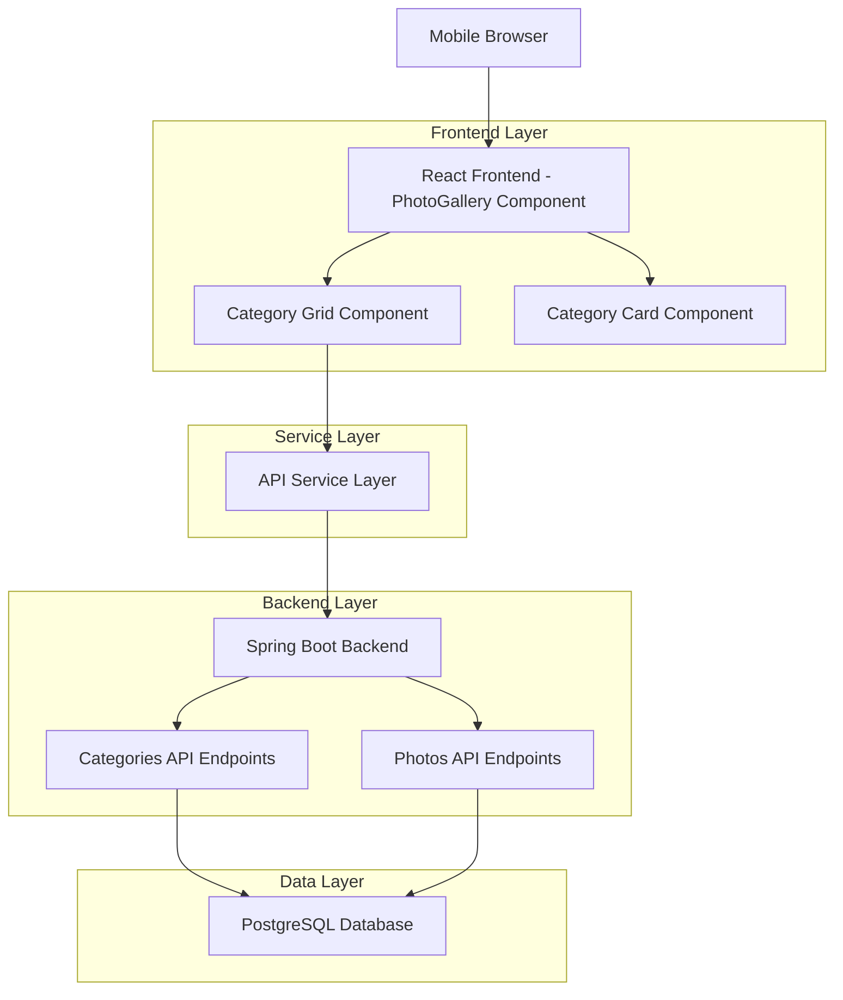
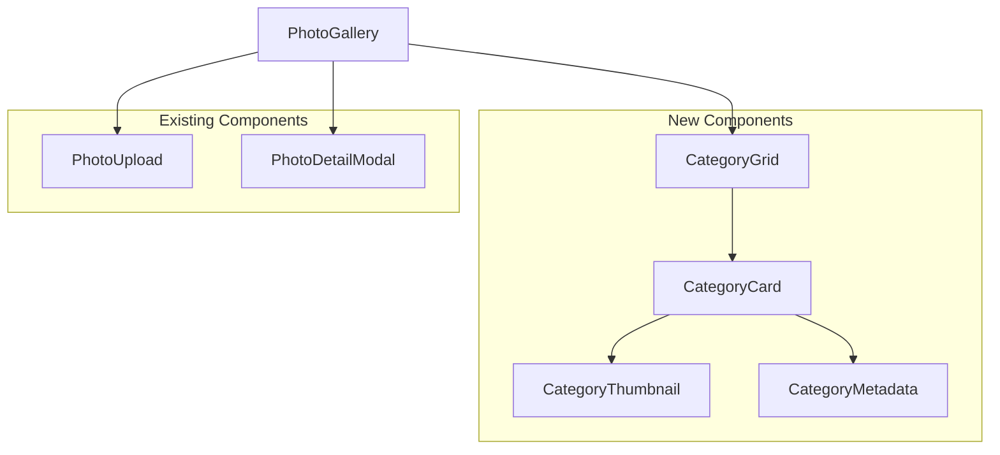

# Mobile Gallery Categories Technical Architecture

## 1. Architecture Design



## 2. Technology Description

- **Frontend**: React@18 + TypeScript + Tailwind CSS@3 + Vite
- **Backend**: Spring Boot (existing)
- **Database**: PostgreSQL (via existing API)
- **Image Processing**: Existing thumbnail API endpoints
- **State Management**: React useState/useEffect hooks

## 3. Route Definitions

| Route | Purpose |
|-------|---------|
| /gallery | Main gallery page with Apple Photos-style categories grid |
| /category/:id | Individual category detail page with full photo grid |
| /photos | All photos view (existing) |

## 4. API Definitions

### 4.1 Categories API

**Get Categories with Latest Photo**
```
GET /api/categories/with-latest-photo
```

Response:
| Param Name | Param Type | Description |
|------------|------------|-------------|
| id | number | Category unique identifier |
| name | string | Category display name |
| color | string | Category color hex code |
| photoCount | number | Total photos in category |
| latestPhoto | Photo | Most recent photo object |

Example Response:
```json
{
  "id": 1,
  "name": "Travel",
  "color": "#3B82F6",
  "photoCount": 24,
  "latestPhoto": {
    "id": 156,
    "filename": "IMG_2024_001.jpg",
    "originalName": "Beach Sunset.jpg",
    "createdAt": "2024-01-15T10:30:00Z"
  }
}
```

### 4.2 Photos API (Existing)

**Get Photo Thumbnail**
```
GET /api/photos/image/{filename}?size=thumbnail
```

**Get Category Photos**
```
GET /api/categories/{categoryId}/photos
```

## 5. Component Architecture

### 5.1 Component Hierarchy



### 5.2 Component Specifications

**CategoryGrid Component**
- Renders responsive 2-column grid for mobile
- Handles loading states and empty states
- Manages category data fetching
- Implements lazy loading for performance

**CategoryCard Component**
- Displays single latest photo thumbnail
- Shows category name and photo count
- Handles tap/click navigation to category detail
- Implements Apple Photos visual styling

**CategoryThumbnail Component**
- Renders square aspect ratio image
- Handles loading placeholders
- Implements error fallback states
- Optimizes for retina displays

## 6. Data Model

### 6.1 Enhanced Category Interface

```typescript
interface Category {
  id: number;
  name: string;
  color: string;
  photoCount: number;
  latestPhoto?: Photo;
  createdAt: string;
  updatedAt: string;
}

interface Photo {
  id: number;
  filename: string;
  originalName: string;
  caption?: string;
  createdAt: string;
  uploader: { name: string };
  categories: Category[];
  isFavorite?: boolean;
}
```

### 6.2 Mobile-Specific State Management

```typescript
interface MobileGalleryState {
  categories: Category[];
  loading: boolean;
  error: string | null;
  imageSize: 'small' | 'medium' | 'large';
  selectedCategory: Category | null;
}
```

## 7. Performance Optimizations

### 7.1 Image Loading Strategy
- Use `loading="lazy"` for off-screen thumbnails
- Implement intersection observer for advanced lazy loading
- Serve optimized thumbnail sizes (150x150px for mobile)
- Add progressive image loading with blur-up technique

### 7.2 Component Optimization
- Wrap CategoryCard in React.memo to prevent unnecessary re-renders
- Use useMemo for expensive category filtering operations
- Implement virtual scrolling for large category lists
- Debounce navigation actions to prevent double-taps

### 7.3 API Optimization
- Cache category data with latest photos
- Implement stale-while-revalidate pattern
- Batch API requests where possible
- Use HTTP caching headers for thumbnail images

## 8. Mobile Responsive Design

### 8.1 Breakpoint Strategy

```css
/* Mobile First Approach */
.category-grid {
  /* Base: Mobile (320px+) */
  grid-template-columns: repeat(2, 1fr);
  gap: 12px;
  padding: 16px;
}

@media (min-width: 480px) {
  /* Large Mobile */
  .category-grid {
    grid-template-columns: repeat(3, 1fr);
    gap: 16px;
  }
}

@media (min-width: 768px) {
  /* Tablet+ - Revert to desktop layout */
  .category-grid {
    grid-template-columns: repeat(2, 1fr);
    gap: 24px;
  }
}
```

### 8.2 Touch Optimization
- Minimum 44px touch targets for category cards
- Generous padding around interactive elements
- Clear visual feedback on tap (scale transform)
- Prevent accidental double-taps with debouncing

## 9. Implementation Plan

### 9.1 Phase 1: Component Structure
1. Create CategoryGrid component with mobile-first responsive grid
2. Build CategoryCard component with Apple Photos styling
3. Implement CategoryThumbnail with loading states
4. Add CategoryMetadata for name and count display

### 9.2 Phase 2: Data Integration
1. Modify category API to include latest photo
2. Update PhotoGallery component to use new grid
3. Implement proper error handling and loading states
4. Add navigation to category detail pages

### 9.3 Phase 3: Performance & Polish
1. Add lazy loading and image optimization
2. Implement smooth animations and transitions
3. Add accessibility features (ARIA labels, keyboard navigation)
4. Optimize for various mobile screen sizes

## 10. Testing Strategy

### 10.1 Mobile Testing
- Test on various mobile devices (iPhone, Android)
- Verify touch interactions and gesture handling
- Validate responsive breakpoints
- Check performance on slower devices

### 10.2 Visual Testing
- Compare with Apple Photos reference design
- Verify consistent spacing and typography
- Test loading states and error conditions
- Validate accessibility compliance