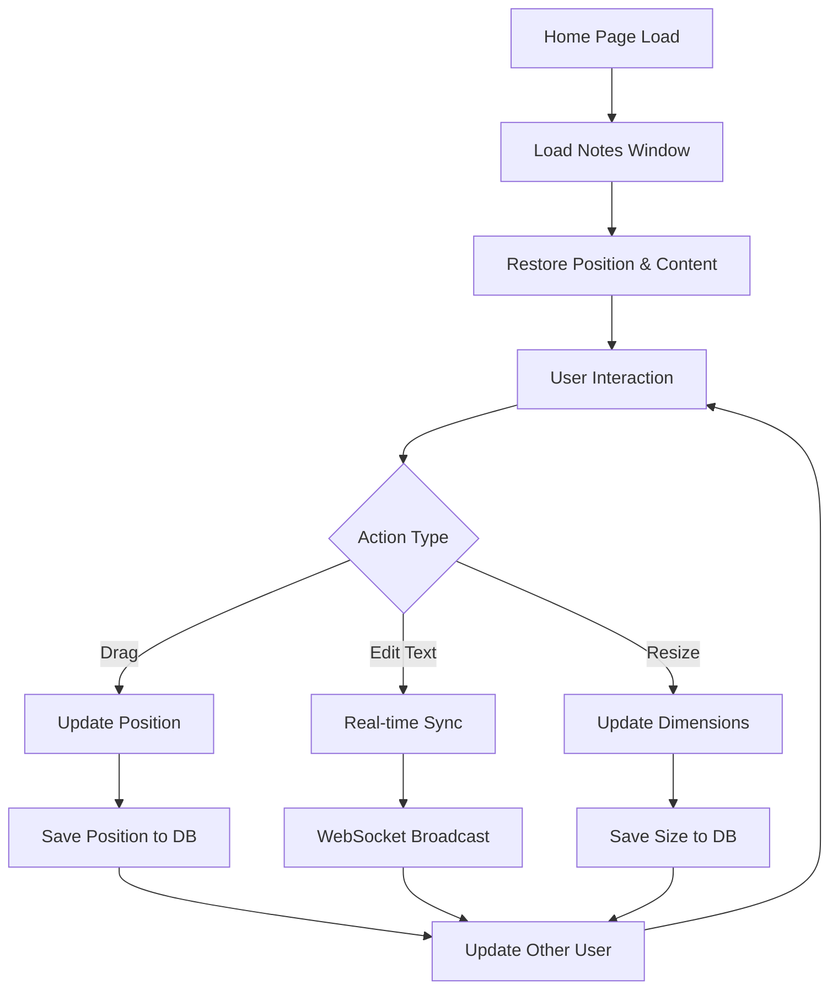

# Collaborative Notes Pad - Product Requirements Document

## 1. Product Overview
A real-time collaborative notes pad feature that allows both users in a couple to create, edit, and share notes together on the home page. The notes pad appears as a draggable, resizable window that synchronizes content instantly between users, enabling seamless collaborative note-taking and communication.

The feature solves the problem of quick note sharing between couples, providing an always-accessible shared space for reminders, thoughts, shopping lists, or any other collaborative content that needs immediate visibility and real-time updates.

## 2. Core Features

### 2.1 User Roles
| Role | Registration Method | Core Permissions |
|------|---------------------|------------------|
| Couple User | Existing user authentication | Can create, edit, delete notes; move and resize window; view real-time changes |

### 2.2 Feature Module
Our collaborative notes pad consists of the following main components:
1. **Draggable Notes Window**: Floating, moveable window interface with drag handles and resize controls.
2. **Real-time Editor**: Collaborative text editor with live synchronization and conflict resolution.
3. **Position Persistence**: Window position and size storage that remembers user preferences.
4. **Collaboration Indicators**: Visual cues showing other user's activity and cursor position.

### 2.3 Page Details
| Page Name | Module Name | Feature description |
|-----------|-------------|---------------------|
| Home Page | Draggable Notes Window | Floating window with drag handle, resize corners, minimize/maximize buttons, and close functionality |
| Home Page | Real-time Text Editor | Multi-line text area with auto-save, real-time synchronization, character limit, and formatting preservation |
| Home Page | Collaboration Indicators | User presence indicators, cursor position display, typing indicators, and conflict resolution notifications |
| Home Page | Window Controls | Position persistence, size memory, minimize/restore states, and z-index management |

## 3. Core Process

**Primary User Flow:**
1. User opens home page and sees the notes pad window (if previously positioned) or default position
2. User can drag the window by clicking and holding the title bar to move it anywhere on screen
3. User clicks inside the text area to start editing notes
4. Changes are automatically saved and synchronized in real-time with the other user
5. User can resize the window using corner handles or minimize/maximize controls
6. Window position and size are remembered for next session

**Collaborative Editing Flow:**
1. User A starts typing in the notes pad
2. Changes appear instantly on User B's screen with typing indicators
3. If both users edit simultaneously, conflict resolution ensures no data loss
4. Visual indicators show where the other user is editing
5. All changes are persisted to database with timestamps

## 4. User Interface Design

### 4.1 Design Style
- **Primary Colors**: Soft blue (#3B82F6) for active states, light gray (#F3F4F6) for backgrounds
- **Secondary Colors**: Green (#10B981) for collaboration indicators, amber (#F59E0B) for warnings
- **Window Style**: Modern floating window with subtle shadow, rounded corners (8px radius)
- **Typography**: System font stack, 14px base size for content, 12px for UI elements
- **Layout Style**: Compact floating window design with clean, minimal interface
- **Icons**: Feather icons for drag handles, resize controls, and action buttons

### 4.2 Page Design Overview
| Page Name | Module Name | UI Elements |
|-----------|-------------|-------------|
| Home Page | Draggable Notes Window | Floating window (300x400px default), subtle drop shadow, rounded corners, semi-transparent title bar with drag handle icon |
| Home Page | Window Title Bar | Drag handle icon, "Shared Notes" title, minimize/maximize/close buttons, collaboration status indicator |
| Home Page | Text Editor Area | Clean textarea with no borders, placeholder text, auto-resize height, scroll for overflow, typing indicators overlay |
| Home Page | Resize Controls | Corner resize handles (8px squares), hover states with cursor changes, smooth resize animations |
| Home Page | Collaboration UI | Small avatar indicators, colored cursor positions, typing status badges, connection status icon |

### 4.3 Responsiveness
The notes pad is desktop-first with mobile adaptations. On mobile devices, the window becomes full-width and fixed-position to ensure usability. Touch interactions are optimized for drag operations and text editing on smaller screens.