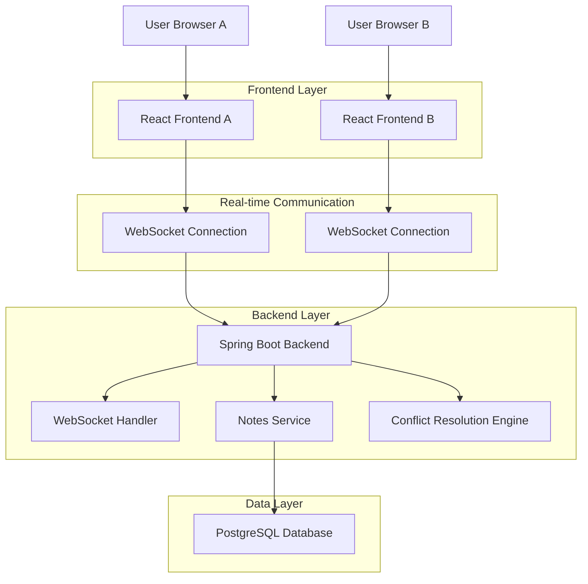
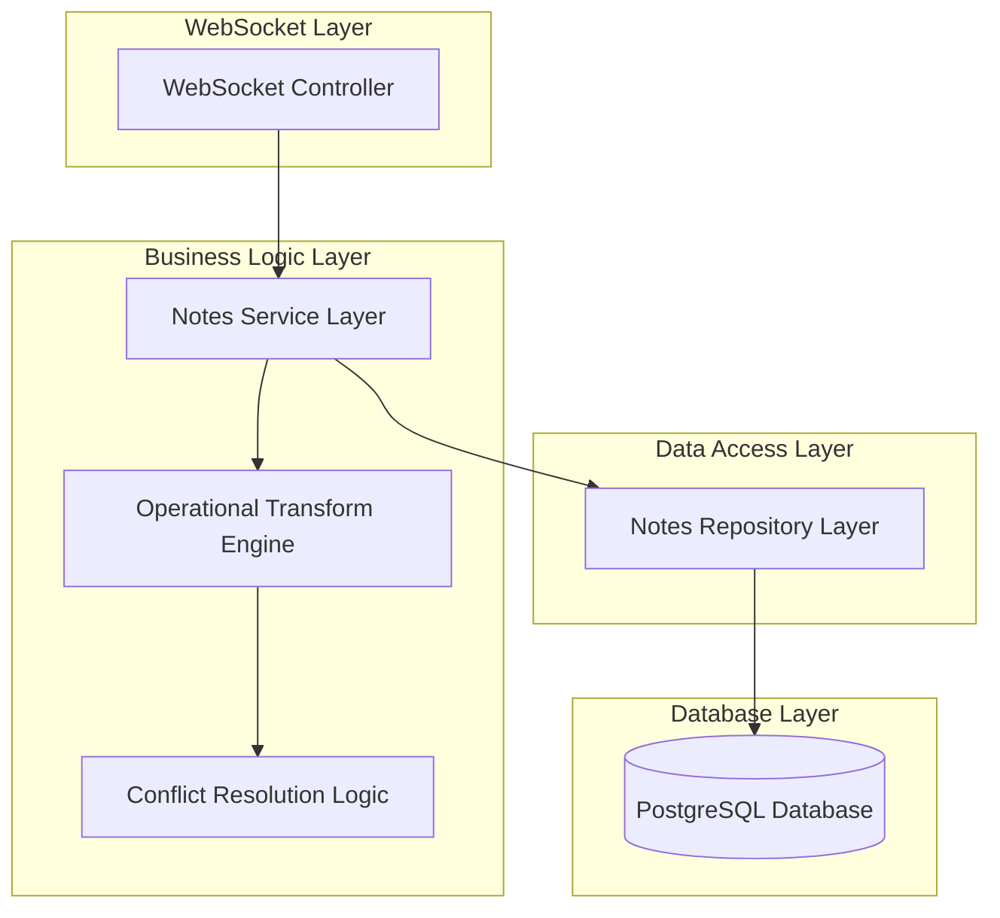
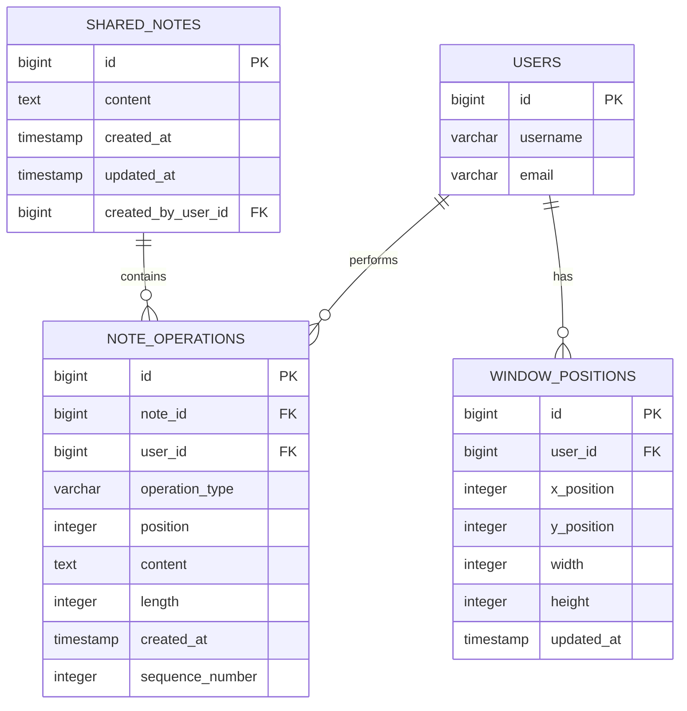

# Collaborative Notes Pad - Technical Architecture Document

## 1. Architecture Design



## 2. Technology Description

- Frontend: React@18 + TypeScript + Framer Motion (for drag animations) + React DnD (drag and drop)
- Backend: Spring Boot + WebSocket + Spring Data JPA
- Database: PostgreSQL (existing Supabase instance)
- Real-time: WebSocket with STOMP protocol
- Conflict Resolution: Operational Transform (OT) algorithm

## 3. Route Definitions

| Route | Purpose |
|-------|---------|
| /home | Home page with integrated collaborative notes pad window |
| /api/notes | REST endpoints for notes CRUD operations |
| /ws/notes | WebSocket endpoint for real-time collaboration |

## 4. API Definitions

### 4.1 Core API

**Notes Management**
```
GET /api/notes/shared
```
Request: None (uses authenticated user context)
Response:
| Param Name | Param Type | Description |
|------------|------------|-------------|
| id | Long | Unique note identifier |
| content | String | Note content text |
| windowPosition | Object | {x, y, width, height} window coordinates |
| lastModified | DateTime | Last modification timestamp |
| lastModifiedBy | Long | User ID who last modified |

**Real-time Updates**
```
POST /api/notes/update
```
Request:
| Param Name | Param Type | isRequired | Description |
|------------|------------|------------|-------------|
| operation | String | true | Operation type: 'insert', 'delete', 'retain' |
| position | Integer | true | Character position in document |
| content | String | false | Content to insert (for insert operations) |
| length | Integer | false | Length of operation (for delete/retain) |

**Window Position Updates**
```
PUT /api/notes/position
```
Request:
| Param Name | Param Type | isRequired | Description |
|------------|------------|------------|-------------|
| x | Integer | true | Window X coordinate |
| y | Integer | true | Window Y coordinate |
| width | Integer | true | Window width |
| height | Integer | true | Window height |

Example WebSocket Message:
```json
{
  "type": "TEXT_OPERATION",
  "operation": {
    "type": "insert",
    "position": 15,
    "content": "Hello world",
    "userId": 123,
    "timestamp": "2024-01-15T10:30:00Z"
  }
}
```

## 5. Server Architecture Diagram



## 6. Data Model

### 6.1 Data Model Definition



### 6.2 Data Definition Language

**Shared Notes Table**
```sql
-- Create shared notes table
CREATE TABLE shared_notes (
    id BIGSERIAL PRIMARY KEY,
    content TEXT DEFAULT '',
    created_at TIMESTAMP WITH TIME ZONE DEFAULT NOW(),
    updated_at TIMESTAMP WITH TIME ZONE DEFAULT NOW(),
    created_by_user_id BIGINT REFERENCES users(id)
);

-- Create index for performance
CREATE INDEX idx_shared_notes_updated_at ON shared_notes(updated_at DESC);

-- Grant permissions
GRANT SELECT, INSERT, UPDATE ON shared_notes TO authenticated;
GRANT USAGE ON SEQUENCE shared_notes_id_seq TO authenticated;
```

**Note Operations Table (for Operational Transform)**
```sql
-- Create note operations table for conflict resolution
CREATE TABLE note_operations (
    id BIGSERIAL PRIMARY KEY,
    note_id BIGINT REFERENCES shared_notes(id) ON DELETE CASCADE,
    user_id BIGINT REFERENCES users(id),
    operation_type VARCHAR(20) NOT NULL CHECK (operation_type IN ('insert', 'delete', 'retain')),
    position INTEGER NOT NULL,
    content TEXT,
    length INTEGER,
    created_at TIMESTAMP WITH TIME ZONE DEFAULT NOW(),
    sequence_number INTEGER NOT NULL
);

-- Create indexes for performance
CREATE INDEX idx_note_operations_note_id ON note_operations(note_id);
CREATE INDEX idx_note_operations_sequence ON note_operations(note_id, sequence_number);
CREATE INDEX idx_note_operations_created_at ON note_operations(created_at DESC);

-- Grant permissions
GRANT SELECT, INSERT ON note_operations TO authenticated;
GRANT USAGE ON SEQUENCE note_operations_id_seq TO authenticated;
```

**Window Positions Table**
```sql
-- Create window positions table
CREATE TABLE window_positions (
    id BIGSERIAL PRIMARY KEY,
    user_id BIGINT REFERENCES users(id) UNIQUE,
    x_position INTEGER DEFAULT 100,
    y_position INTEGER DEFAULT 100,
    width INTEGER DEFAULT 300,
    height INTEGER DEFAULT 400,
    updated_at TIMESTAMP WITH TIME ZONE DEFAULT NOW()
);

-- Create index
CREATE INDEX idx_window_positions_user_id ON window_positions(user_id);

-- Grant permissions
GRANT ALL PRIVILEGES ON window_positions TO authenticated;
GRANT USAGE ON SEQUENCE window_positions_id_seq TO authenticated;
```

**Initial Data Setup**
```sql
-- Create a default shared note for couples
INSERT INTO shared_notes (content, created_by_user_id) 
VALUES ('Welcome to your shared notes! Start typing here...', 1);

-- Set default window positions for existing users
INSERT INTO window_positions (user_id, x_position, y_position, width, height)
SELECT id, 100, 100, 300, 400 FROM users
ON CONFLICT (user_id) DO NOTHING;
```