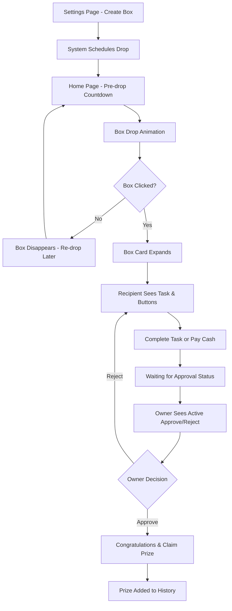

# Surprise Box Feature - Product Requirements Document

## 1. Product Overview

The Surprise Box system enables users to create and exchange interactive surprise boxes with tasks, prizes, and gamified approval flows. Recipients receive animated box drops on their home page, complete tasks or pay for prizes, and await owner approval before claiming rewards.

This feature transforms gift-giving into an engaging, interactive experience that strengthens user relationships through playful task completion and surprise elements.

## 2. Core Features

### 2.1 User Roles

| Role | Registration Method | Core Permissions |
|------|---------------------|------------------|
| Box Owner | Existing user account | Can create one active box, approve/reject recipient actions, view box status |
| Box Recipient | Existing user account | Can receive boxes, complete tasks, pay for prizes, claim approved rewards |

### 2.2 Feature Module

Our Surprise Box system consists of the following main pages:
1. **Settings Page**: box creation interface, prize history section, box management controls.
2. **Home Page**: animated box drops, countdown notifications, surprise box card interactions.
3. **Box Card Component**: task display, action buttons, approval interface, prize claiming.

### 2.3 Page Details

| Page Name | Module Name | Feature description |
|-----------|-------------|---------------------|
| Settings Page | Box Creation Interface | Create new box with prize name, price, task description, expiration time. Edit existing box details. Display "Create Box" button when no active box exists. |
| Settings Page | Prize History Section | Display completed and claimed prizes with details (prize name, completion date, task description). Paginated list view with search functionality. |
| Home Page | Box Drop Animation | Smooth random drop animation from top to bottom. 5-second pre-drop countdown notification. Re-drop mechanism if box not clicked during animation. |
| Home Page | Surprise Box Card | Expandable card showing task description, countdown timer, "Complete Task" and "Pay with Cash" buttons. Status updates and approval interface. |
| Box Card Component | Recipient Interface | Display task description, expiration countdown, action buttons. Show "Waiting for Approval" status after action taken. Display congratulations and "Claim Prize" button when approved. |
| Box Card Component | Owner Interface | Show box details with initially disabled approve button. Enable approve/reject buttons when recipient takes action. Handle approval/rejection flow with status updates. |

## 3. Core Process

**Box Owner Flow:**
1. Owner creates surprise box in settings with prize, task, price, and expiration
2. System schedules random box drop for recipient
3. Owner sees box card on home page with disabled approve button
4. When recipient takes action, approve/reject buttons become active
5. Owner approves or rejects recipient's action
6. If approved, prize is added to history; if rejected, recipient can retry

**Box Recipient Flow:**
1. Recipient receives 5-second countdown notification on home page
2. Box drops with smooth animation from top to bottom
3. Recipient clicks box to open and expand into card view
4. Recipient sees task, countdown timer, and action buttons
5. Recipient clicks "Complete Task" or "Pay with Cash"
6. Status changes to "Waiting for Approval"
7. Upon approval, recipient sees congratulations and claims prize
8. Upon rejection, action buttons reappear for retry

## 4. User Interface Design

### 4.1 Design Style

- **Primary Colors**: Bright treasure chest gold (#FFD700), magical purple (#8A2BE2), success green (#32CD32)
- **Secondary Colors**: Warm orange (#FF8C00), soft blue (#87CEEB), warning red (#FF6347)
- **Button Style**: Rounded corners with gradient effects, 3D treasure chest appearance for main box
- **Font**: Playful yet readable font family (Poppins), sizes 14px-24px for different elements
- **Layout Style**: Card-based design with floating animations, top navigation with notification badges
- **Icons**: Treasure chest 🎁, countdown timer ⏰, approval checkmark ✅, rejection cross ❌

### 4.2 Page Design Overview

| Page Name | Module Name | UI Elements |
|-----------|-------------|-------------|
| Settings Page | Box Creation Interface | Form with input fields, gradient "Create Box" button, treasure chest icon, warm gold/purple color scheme |
| Settings Page | Prize History Section | Card-based list layout, timeline design, completion badges, search bar with filter options |
| Home Page | Box Drop Animation | Full-screen overlay during drop, smooth CSS animations, particle effects, countdown timer with pulsing animation |
| Home Page | Surprise Box Card | Expandable card with rounded corners, gradient background, task description in readable typography, prominent action buttons |
| Box Card Component | Recipient Interface | Countdown timer with progress ring, large action buttons with hover effects, status indicators with color coding |
| Box Card Component | Owner Interface | Approval buttons with distinct colors (green/red), box details in organized layout, status synchronization indicators |

### 4.3 Responsiveness

Desktop-first design with mobile-adaptive breakpoints. Touch interaction optimization for mobile box clicking and button interactions. Responsive animations that scale appropriately across screen sizes.

## 5. Business Rules

1. **One Active Box Rule**: Each user can own only one active surprise box at a time
2. **One-to-One Relationship**: Boxes are always created for a specific recipient user
3. **Expiration Handling**: Boxes that expire will automatically re-drop until successfully completed
4. **State Synchronization**: All interactions must be real-time synchronized between owner and recipient
5. **Prize Claiming**: Prizes can only be claimed once and are immediately added to history
6. **Retry Mechanism**: Recipients can retry tasks unlimited times if rejected by owner

## 6. Technical Constraints

1. **Real-time Updates**: System must support WebSocket or polling for live state synchronization
2. **Animation Performance**: Smooth 60fps animations across all supported devices
3. **Persistence**: All box states, actions, and history must be persisted in database
4. **Scalability**: System should handle multiple concurrent box drops and interactions
5. **Security**: Prevent manipulation of box states and ensure proper user authorization
6. **Mobile Compatibility**: Touch-friendly interactions and responsive design requirements