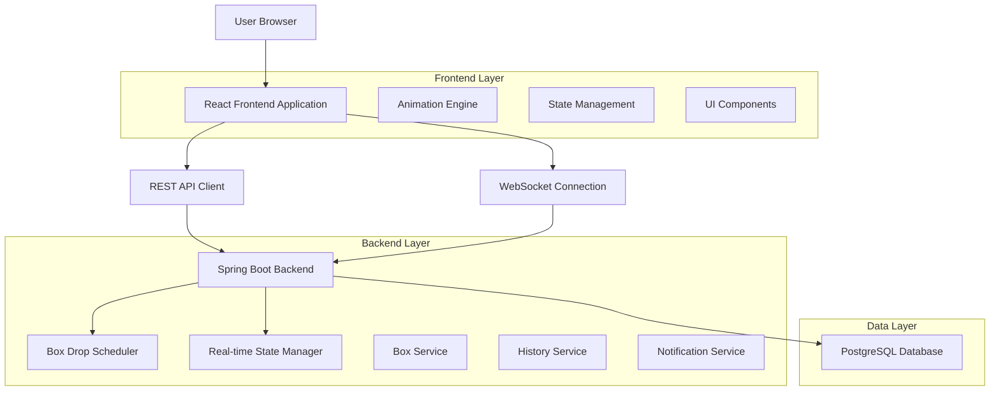
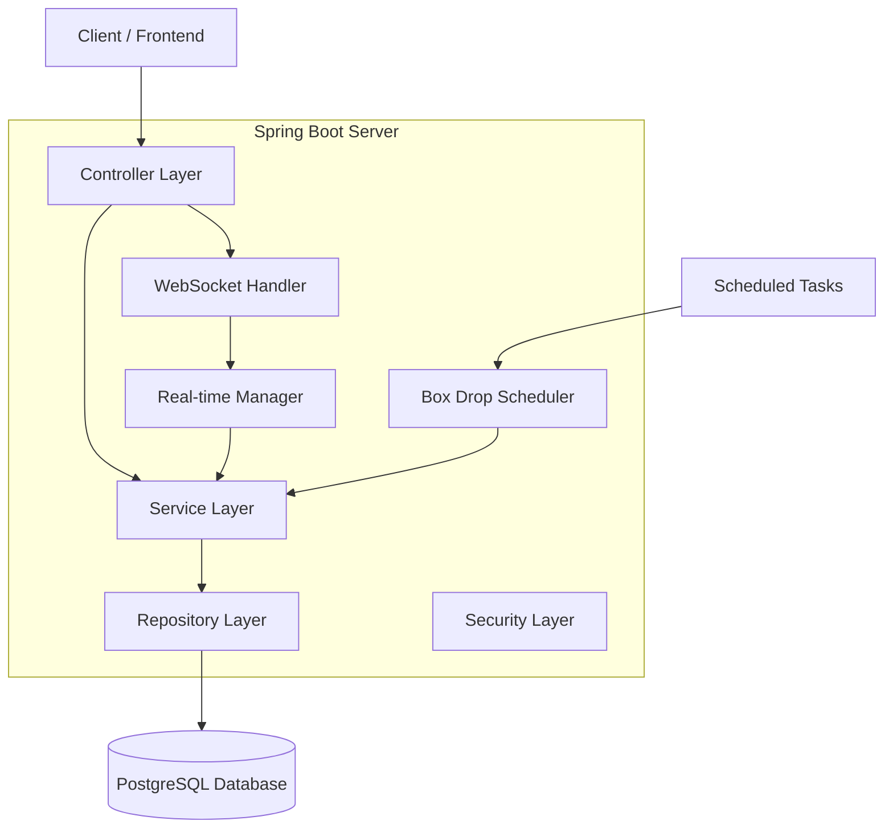
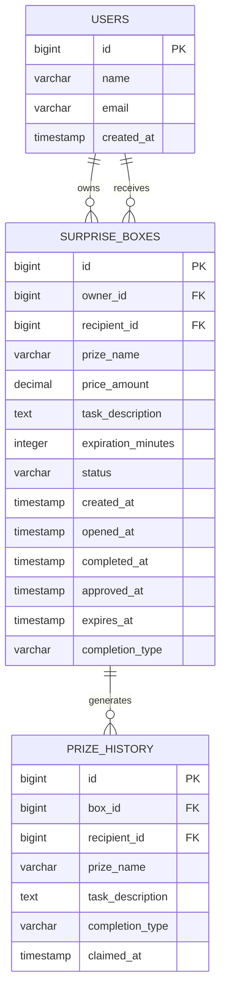

# Surprise Box Feature - Technical Architecture Document

## 1. Architecture Design



## 2. Technology Description

- **Frontend**: React@18 + TypeScript + Tailwind CSS + Framer Motion (animations) + Socket.IO Client
- **Backend**: Spring Boot@3 + Spring WebSocket + Spring Data JPA + Spring Security
- **Database**: PostgreSQL (via existing setup)
- **Real-time**: WebSocket for live state synchronization
- **Scheduling**: Spring @Scheduled for box drop timing

## 3. Route Definitions

| Route | Purpose |
|-------|----------|
| /settings | Settings page with box creation and prize history |
| /home | Home page with box drops and surprise box cards |
| /surprise-box/:id | Individual box detail view (if needed) |

## 4. API Definitions

### 4.1 Core API

**Box Management**
```
POST /api/surprise-boxes
```
Request:
| Param Name | Param Type | isRequired | Description |
|------------|------------|------------|-------------|
| recipientId | Long | true | ID of the user who will receive the box |
| prizeName | String | true | Name of the prize |
| priceAmount | BigDecimal | true | Price for the prize option |
| taskDescription | String | true | Description of the task to complete |
| expirationMinutes | Integer | true | Minutes until expiration after opening |

Response:
| Param Name | Param Type | Description |
|------------|------------|-------------|
| id | Long | Unique box identifier |
| status | String | Box status (CREATED, DROPPED, OPENED, WAITING_APPROVAL, APPROVED, REJECTED, EXPIRED) |
| createdAt | LocalDateTime | Box creation timestamp |

```
GET /api/surprise-boxes/owned
```
Response: List of boxes owned by current user

```
GET /api/surprise-boxes/received
```
Response: List of boxes received by current user

```
PUT /api/surprise-boxes/{id}
```
Request: Same as POST (for editing existing box)

**Box Interactions**
```
POST /api/surprise-boxes/{id}/open
```
Marks box as opened by recipient

```
POST /api/surprise-boxes/{id}/complete-task
```
Recipient completes the task

```
POST /api/surprise-boxes/{id}/pay-cash
```
Recipient chooses to pay for prize

```
POST /api/surprise-boxes/{id}/approve
```
Owner approves recipient's action

```
POST /api/surprise-boxes/{id}/reject
```
Owner rejects recipient's action

```
POST /api/surprise-boxes/{id}/claim-prize
```
Recipient claims approved prize

**Prize History**
```
GET /api/prize-history
```
Response: List of claimed prizes for current user

### 4.2 WebSocket Events

**Box Drop Events**
- `box-drop-countdown`: 5-second countdown before drop
- `box-drop-start`: Box drop animation begins
- `box-status-update`: Real-time status changes
- `approval-update`: Owner approval/rejection notifications

## 5. Server Architecture Diagram



## 6. Data Model

### 6.1 Data Model Definition



### 6.2 Data Definition Language

**Surprise Boxes Table**
```sql
-- Create surprise_boxes table
CREATE TABLE surprise_boxes (
    id BIGSERIAL PRIMARY KEY,
    owner_id BIGINT NOT NULL REFERENCES users(id),
    recipient_id BIGINT NOT NULL REFERENCES users(id),
    prize_name VARCHAR(255) NOT NULL,
    price_amount DECIMAL(10,2) NOT NULL,
    task_description TEXT NOT NULL,
    expiration_minutes INTEGER NOT NULL DEFAULT 60,
    status VARCHAR(50) NOT NULL DEFAULT 'CREATED',
    created_at TIMESTAMP WITH TIME ZONE DEFAULT NOW(),
    opened_at TIMESTAMP WITH TIME ZONE,
    completed_at TIMESTAMP WITH TIME ZONE,
    approved_at TIMESTAMP WITH TIME ZONE,
    expires_at TIMESTAMP WITH TIME ZONE,
    completion_type VARCHAR(20), -- 'TASK' or 'PAYMENT'
    CONSTRAINT chk_status CHECK (status IN ('CREATED', 'DROPPED', 'OPENED', 'WAITING_APPROVAL', 'APPROVED', 'REJECTED', 'EXPIRED', 'CLAIMED')),
    CONSTRAINT chk_completion_type CHECK (completion_type IN ('TASK', 'PAYMENT') OR completion_type IS NULL)
);

-- Create indexes
CREATE INDEX idx_surprise_boxes_owner_id ON surprise_boxes(owner_id);
CREATE INDEX idx_surprise_boxes_recipient_id ON surprise_boxes(recipient_id);
CREATE INDEX idx_surprise_boxes_status ON surprise_boxes(status);
CREATE INDEX idx_surprise_boxes_expires_at ON surprise_boxes(expires_at);

-- Prize History Table
CREATE TABLE prize_history (
    id BIGSERIAL PRIMARY KEY,
    box_id BIGINT NOT NULL REFERENCES surprise_boxes(id),
    recipient_id BIGINT NOT NULL REFERENCES users(id),
    prize_name VARCHAR(255) NOT NULL,
    task_description TEXT NOT NULL,
    completion_type VARCHAR(20) NOT NULL,
    claimed_at TIMESTAMP WITH TIME ZONE DEFAULT NOW(),
    CONSTRAINT chk_prize_completion_type CHECK (completion_type IN ('TASK', 'PAYMENT'))
);

-- Create indexes for prize history
CREATE INDEX idx_prize_history_recipient_id ON prize_history(recipient_id);
CREATE INDEX idx_prize_history_claimed_at ON prize_history(claimed_at DESC);
CREATE INDEX idx_prize_history_box_id ON prize_history(box_id);

-- Grant permissions
GRANT SELECT ON surprise_boxes TO anon;
GRANT ALL PRIVILEGES ON surprise_boxes TO authenticated;
GRANT SELECT ON prize_history TO anon;
GRANT ALL PRIVILEGES ON prize_history TO authenticated;
```

## 7. Frontend Component Architecture

### 7.1 Component Structure

```
src/components/SurpriseBox/
├── SurpriseBoxManager.tsx          // Main container component
├── BoxCreationForm.tsx             // Settings page box creation
├── PrizeHistory.tsx                // Settings page history display
├── BoxDropAnimation.tsx            // Home page drop animation
├── SurpriseBoxCard.tsx             // Expandable box card
├── CountdownTimer.tsx              // Reusable countdown component
├── BoxStatusIndicator.tsx          // Status display component
└── animations/
    ├── dropAnimation.ts            // Box drop animation logic
    ├── expandAnimation.ts          // Card expansion animation
    └── prizeReveal.ts              // Prize reveal animation
```

### 7.2 State Management

```typescript
// Global state structure
interface SurpriseBoxState {
  ownedBox: SurpriseBox | null;
  receivedBoxes: SurpriseBox[];
  prizeHistory: PrizeHistoryItem[];
  dropAnimation: {
    isActive: boolean;
    countdown: number;
    boxId: number | null;
  };
  notifications: Notification[];
}

// Box status enum
enum BoxStatus {
  CREATED = 'CREATED',
  DROPPED = 'DROPPED',
  OPENED = 'OPENED',
  WAITING_APPROVAL = 'WAITING_APPROVAL',
  APPROVED = 'APPROVED',
  REJECTED = 'REJECTED',
  EXPIRED = 'EXPIRED',
  CLAIMED = 'CLAIMED'
}
```

### 7.3 Animation Specifications

- **Box Drop**: CSS transform with easing, 3-5 second duration, random horizontal positioning
- **Card Expansion**: Framer Motion spring animation, scale and opacity transitions
- **Countdown Timer**: Circular progress indicator with color changes (green → yellow → red)
- **Prize Reveal**: Confetti effect with bounce animation and sparkle particles
- **Button States**: Hover effects, loading spinners, success/error feedback animations

## 8. Real-time Synchronization

### 8.1 WebSocket Implementation

```java
@Controller
public class SurpriseBoxWebSocketController {
    
    @MessageMapping("/box-action")
    @SendToUser("/queue/box-updates")
    public BoxUpdateMessage handleBoxAction(BoxActionMessage message) {
        // Process box action and return update
    }
    
    @MessageMapping("/box-status")
    @SendTo("/topic/box-status/{boxId}")
    public BoxStatusMessage updateBoxStatus(Long boxId, String status) {
        // Broadcast status update to all interested parties
    }
}
```

### 8.2 Scheduled Tasks

```java
@Component
public class BoxDropScheduler {
    
    @Scheduled(fixedRate = 30000) // Check every 30 seconds
    public void scheduleBoxDrops() {
        // Find boxes ready for dropping
        // Trigger drop animations via WebSocket
    }
    
    @Scheduled(fixedRate = 60000) // Check every minute
    public void handleExpiredBoxes() {
        // Find and expire boxes past their deadline
        // Schedule re-drops for expired boxes
    }
}
```

## 9. Security Considerations

- **Authorization**: Users can only create boxes for existing users, only interact with their own boxes
- **Validation**: Server-side validation for all box creation and interaction requests
- **Rate Limiting**: Prevent spam box creation and rapid-fire interactions
- **State Integrity**: Ensure box status transitions follow valid state machine rules
- **WebSocket Security**: Authenticate WebSocket connections and validate message sources