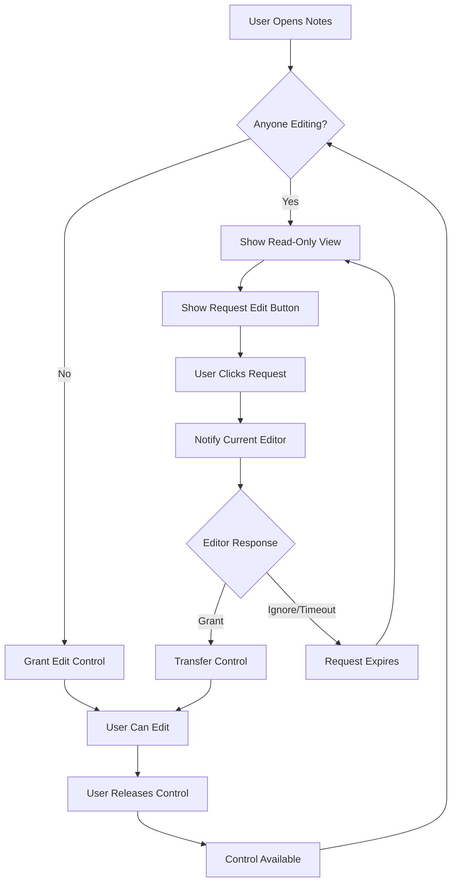

# Turn-Based Collaborative Notes - Product Requirements Document

## 1. Product Overview
A simplified collaborative note-taking system where only one user can edit at a time, while the other user views in read-only mode. This approach eliminates complex operational transformation and provides a clean, conflict-free editing experience.

The system solves the problem of concurrent editing conflicts by implementing a turn-based approach with clear visual indicators and smooth handoff mechanisms between users.

## 2. Core Features

### 2.1 User Roles
| Role | Registration Method | Core Permissions |
|------|---------------------|------------------|
| Editor | Currently active user | Can edit content, request edit control, release edit control |
| Viewer | Non-active user | Can view content in real-time, request edit control, see who is editing |

### 2.2 Feature Module
Our turn-based collaborative notes system consists of the following main pages:
1. **Shared Notes Page**: Real-time collaborative editing interface with turn-based control, edit status indicators, and handoff mechanisms.

### 2.3 Page Details
| Page Name | Module Name | Feature description |
|-----------|-------------|---------------------|
| Shared Notes Page | Edit Control System | Manage who has editing permissions, handle edit requests, automatic timeout mechanisms |
| Shared Notes Page | Visual Status Indicators | Show current editor, edit request notifications, connection status, typing indicators |
| Shared Notes Page | Content Synchronization | Real-time content updates, conflict-free synchronization, cursor position sharing |
| Shared Notes Page | Handoff Mechanism | Request edit control, release edit control, automatic handoff on inactivity |
| Shared Notes Page | User Interface States | Editable mode with full controls, read-only mode with request button, transition animations |

## 3. Core Process

### Editor Flow
1. User opens shared notes page
2. System checks current edit status
3. If no one is editing, user gets edit control automatically
4. If someone else is editing, user sees read-only view with "Request Edit" button
5. User can type and edit when they have control
6. User can release control manually or system releases after inactivity
7. Real-time content updates are sent to all viewers

### Viewer Flow
1. User opens shared notes page in read-only mode
2. User sees real-time updates from the current editor
3. User can click "Request Edit" to ask for control
4. System notifies current editor of the request
5. When control is granted, user interface switches to editable mode
6. User becomes the new editor and previous editor becomes viewer

### Edit Control Handoff Process
1. Viewer clicks "Request Edit" button
2. Current editor receives notification with options: "Grant" or "Ignore"
3. If granted, edit control transfers immediately
4. If ignored, request expires after 30 seconds
5. If current editor is inactive for 2 minutes, control automatically transfers
6. System broadcasts edit control changes to all connected users

## 4. User Interface Design

### 4.1 Design Style
- **Primary Colors**: Blue (#3B82F6) for active editor, Gray (#6B7280) for viewer mode
- **Secondary Colors**: Green (#10B981) for available state, Orange (#F59E0B) for pending requests
- **Button Style**: Rounded corners with subtle shadows, clear state indicators
- **Font**: Inter or system font, 14px for body text, 16px for editor content
- **Layout Style**: Clean card-based design with prominent status bar at top
- **Icons**: Feather icons for edit, eye, user, and notification states

### 4.2 Page Design Overview
| Page Name | Module Name | UI Elements |
|-----------|-------------|-------------|
| Shared Notes Page | Status Bar | Top banner showing current editor name, edit status with colored indicators, connection status |
| Shared Notes Page | Edit Control Panel | "Request Edit" button (when viewer), "Release Control" button (when editor), request notifications |
| Shared Notes Page | Content Area | Full-height textarea (editable/read-only), real-time content synchronization, cursor position indicators |
| Shared Notes Page | User Indicators | Avatar/name of current editor, typing indicator animations, user connection status |
| Shared Notes Page | Notification System | Toast notifications for edit requests, control transfers, connection changes |

### 4.3 Responsiveness
The system is designed mobile-first with responsive design for both desktop and mobile devices. Touch interactions are optimized for mobile users, with larger touch targets for edit control buttons and smooth transitions between edit states.

## 5. Technical Considerations

### 5.1 Edit Lock Mechanism
- Server maintains single "edit lock" state with current editor ID
- WebSocket broadcasts edit lock changes to all connected clients
- Automatic timeout releases lock after 2 minutes of inactivity
- Graceful handling of user disconnections

### 5.2 Content Synchronization
- Simple content replacement instead of operational transformation
- Real-time updates sent only from current editor to all viewers
- Cursor position sharing for better collaboration awareness
- Conflict-free updates eliminate complex merge logic

### 5.3 User Experience Features
- Smooth visual transitions between edit/view modes
- Clear feedback for all user actions
- Intuitive request/grant workflow
- Automatic fallbacks for edge cases (disconnections, timeouts)