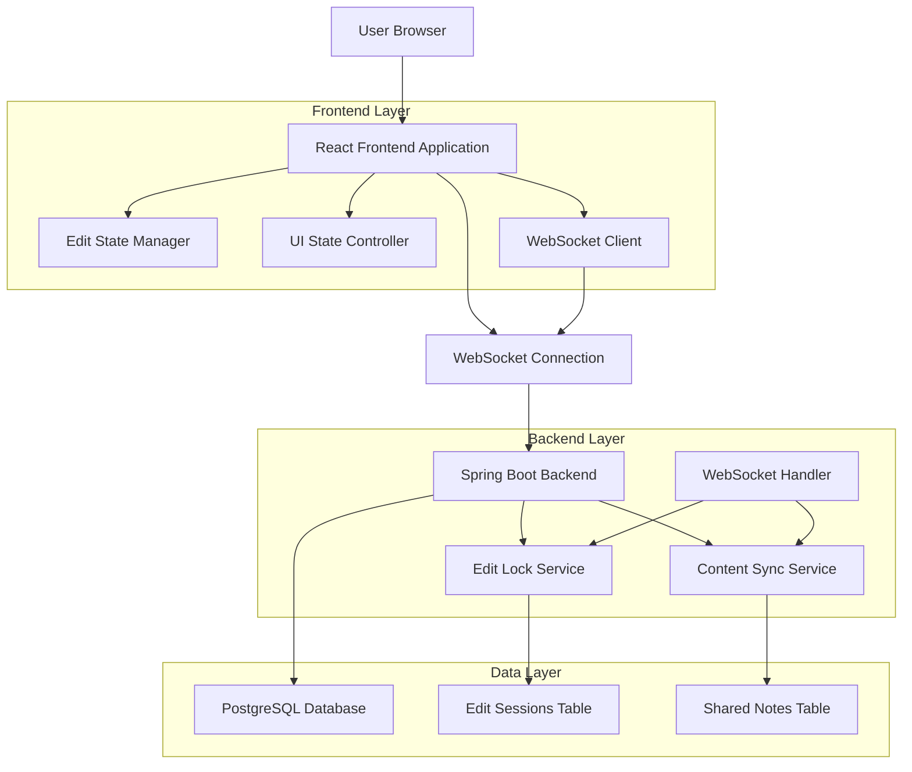
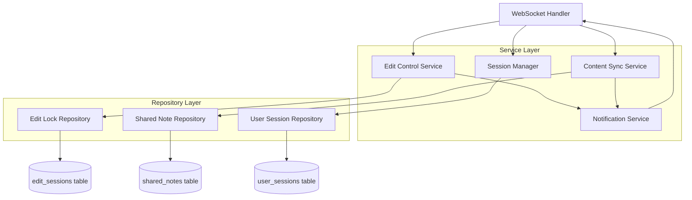
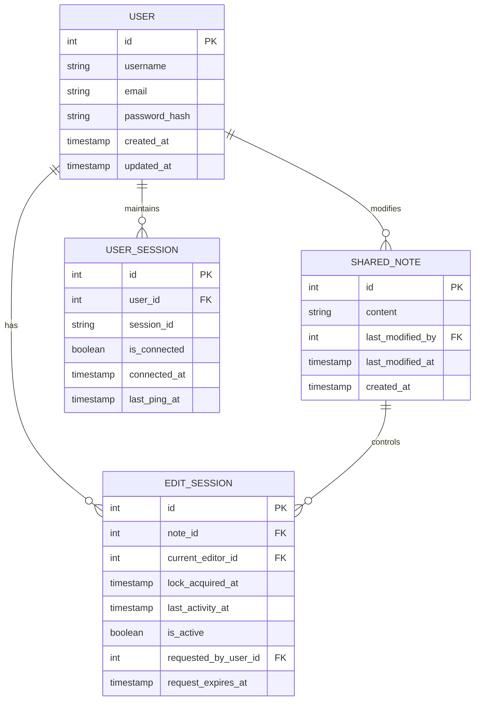

# Turn-Based Collaborative Notes - Technical Architecture Document

## 1. Architecture Design



## 2. Technology Description

* Frontend: React\@18 + TypeScript + Zustand (state management) + TailwindCSS\@3 + Vite

* Backend: Spring Boot\@3 + WebSocket + JPA/Hibernate

* Database: PostgreSQL (via Supabase)

* Real-time Communication: WebSocket for bidirectional communication

## 3. Route Definitions

| Route         | Purpose                                                    |
| ------------- | ---------------------------------------------------------- |
| /shared-notes | Main collaborative notes interface with turn-based editing |
| /login        | User authentication page                                   |
| /register     | User registration page                                     |

## 4. API Definitions

### 4.1 WebSocket Messages

**Edit Control Request**

```typescript
// Client to Server
{
  type: 'REQUEST_EDIT_CONTROL',
  userId: number,
  noteId: number
}

// Server to All Clients
{
  type: 'EDIT_CONTROL_REQUESTED',
  requesterId: number,
  requesterName: string,
  currentEditorId: number
}
```

**Grant Edit Control**

```typescript
// Client to Server
{
  type: 'GRANT_EDIT_CONTROL',
  userId: number,
  noteId: number,
  grantToUserId: number
}

// Server to All Clients
{
  type: 'EDIT_CONTROL_CHANGED',
  newEditorId: number,
  newEditorName: string,
  previousEditorId: number
}
```

**Release Edit Control**

```typescript
// Client to Server
{
  type: 'RELEASE_EDIT_CONTROL',
  userId: number,
  noteId: number
}

// Server to All Clients
{
  type: 'EDIT_CONTROL_RELEASED',
  previousEditorId: number,
  noteId: number
}
```

**Content Update**

```typescript
// Client to Server (only from current editor)
{
  type: 'CONTENT_UPDATE',
  userId: number,
  noteId: number,
  content: string,
  cursorPosition: number
}

// Server to All Clients (except sender)
{
  type: 'CONTENT_UPDATED',
  content: string,
  editorId: number,
  cursorPosition: number,
  timestamp: string
}
```

**Typing Indicator**

```typescript
// Client to Server
{
  type: 'TYPING_STATUS',
  userId: number,
  noteId: number,
  isTyping: boolean
}

// Server to All Clients (except sender)
{
  type: 'USER_TYPING',
  userId: number,
  userName: string,
  isTyping: boolean
}
```

### 4.2 REST API Endpoints

**Get Current Edit Session**

```
GET /api/notes/{noteId}/edit-session
```

Response:

| Param Name        | Param Type     | Description                                     |
| ----------------- | -------------- | ----------------------------------------------- |
| currentEditorId   | number \| null | ID of user currently editing, null if available |
| currentEditorName | string \| null | Name of current editor                          |
| lastActivity      | string         | ISO timestamp of last edit activity             |
| isLocked          | boolean        | Whether note is currently locked for editing    |

**Get Note Content**

```
GET /api/notes/{noteId}/content
```

Response:

| Param Name     | Param Type | Description                        |
| -------------- | ---------- | ---------------------------------- |
| content        | string     | Current note content               |
| lastModified   | string     | ISO timestamp of last modification |
| lastModifiedBy | string     | Name of user who last modified     |

## 5. Server Architecture Diagram



## 6. Data Model

### 6.1 Data Model Definition



### 6.2 Data Definition Language

**Users Table**

```sql
-- Create users table
CREATE TABLE users (
    id SERIAL PRIMARY KEY,
    username VARCHAR(50) UNIQUE NOT NULL,
    email VARCHAR(255) UNIQUE NOT NULL,
    password_hash VARCHAR(255) NOT NULL,
    created_at TIMESTAMP WITH TIME ZONE DEFAULT NOW(),
    updated_at TIMESTAMP WITH TIME ZONE DEFAULT NOW()
);

-- Create index
CREATE INDEX idx_users_username ON users(username);
CREATE INDEX idx_users_email ON users(email);
```

**Shared Notes Table**

```sql
-- Create shared_notes table
CREATE TABLE shared_notes (
    id SERIAL PRIMARY KEY,
    content TEXT DEFAULT '',
    last_modified_by INTEGER REFERENCES users(id),
    last_modified_at TIMESTAMP WITH TIME ZONE DEFAULT NOW(),
    created_at TIMESTAMP WITH TIME ZONE DEFAULT NOW()
);

-- Create index
CREATE INDEX idx_shared_notes_last_modified ON shared_notes(last_modified_at DESC);
```

**Edit Sessions Table**

```sql
-- Create edit_sessions table
CREATE TABLE edit_sessions (
    id SERIAL PRIMARY KEY,
    note_id INTEGER NOT NULL REFERENCES shared_notes(id) ON DELETE CASCADE,
    current_editor_id INTEGER REFERENCES users(id) ON DELETE SET NULL,
    lock_acquired_at TIMESTAMP WITH TIME ZONE,
    last_activity_at TIMESTAMP WITH TIME ZONE,
    is_active BOOLEAN DEFAULT FALSE,
    requested_by_user_id INTEGER REFERENCES users(id) ON DELETE SET NULL,
    request_expires_at TIMESTAMP WITH TIME ZONE,
    created_at TIMESTAMP WITH TIME ZONE DEFAULT NOW()
);

-- Create indexes
CREATE UNIQUE INDEX idx_edit_sessions_note_active ON edit_sessions(note_id) WHERE is_active = TRUE;
CREATE INDEX idx_edit_sessions_current_editor ON edit_sessions(current_editor_id);
CREATE INDEX idx_edit_sessions_last_activity ON edit_sessions(last_activity_at DESC);
```

**User Sessions Table**

```sql
-- Create user_sessions table
CREATE TABLE user_sessions (
    id SERIAL PRIMARY KEY,
    user_id INTEGER NOT NULL REFERENCES users(id) ON DELETE CASCADE,
    session_id VARCHAR(255) UNIQUE NOT NULL,
    is_connected BOOLEAN DEFAULT TRUE,
    connected_at TIMESTAMP WITH TIME ZONE DEFAULT NOW(),
    last_ping_at TIMESTAMP WITH TIME ZONE DEFAULT NOW()
);

-- Create indexes
CREATE INDEX idx_user_sessions_user_id ON user_sessions(user_id);
CREATE INDEX idx_user_sessions_session_id ON user_sessions(session_id);
CREATE INDEX idx_user_sessions_connected ON user_sessions(is_connected, last_ping_at);
```

**Initial Data**

```sql
-- Insert default shared note
INSERT INTO shared_notes (content, created_at) 
VALUES ('Welcome to your shared notes! Click "Request Edit" to start typing...', NOW());

-- Create cleanup function for expired sessions
CREATE OR REPLACE FUNCTION cleanup_expired_edit_sessions()
RETURNS void AS $$
BEGIN
    UPDATE edit_sessions 
    SET is_active = FALSE, 
        current_editor_id = NULL,
        last_activity_at = NOW()
    WHERE is_active = TRUE 
    AND last_activity_at < NOW() - INTERVAL '2 minutes';
END;
$$ LANGUAGE plpgsql;

-- Create cleanup function for disconnected user sessions
CREATE OR REPLACE FUNCTION cleanup_disconnected_sessions()
RETURNS void AS $$
BEGIN
    UPDATE user_sessions 
    SET is_connected = FALSE
    WHERE is_connected = TRUE 
    AND last_ping_at < NOW() - INTERVAL '30 seconds';
END;
$$ LANGUAGE plpgsql;
```

## 7. Key Implementation Features

### 7.1 Edit Lock Management

* Single active edit session per note enforced by database constraints

* Automatic timeout mechanism releases locks after 2 minutes of inactivity

* Graceful handling of user disconnections through session cleanup

### 7.2 Real-time Synchronization

* WebSocket-based bidirectional communication

* Content updates broadcast only from current editor to all viewers

* Typing indicators and cursor position sharing for better UX

### 7.3 Request/Grant Workflow

* Edit control requests with 30-second expiration

* Current editor can grant or ignore requests

* Automatic fallback to first requester if editor disconnects

### 7.4 State Management

* Frontend uses Zustand for predictable state management

* Clear separation between edit mode and view mode states

* Optimistic UI updates with server confirmation

